<p align="center">
  
</p>

<p align="center">
  
  
  
  
</p>

Automated PR review engine for the git-fabric ecosystem. Analyzes diffs for security anti-patterns, dependency risks, Dockerfile issues, and CVE exposure — then posts structured review comments back to GitHub.

---

## How It Works

```
PR opened/updated
      |
      v
  fabric-ctrl gateway
      |
      v
  @git-fabric/review
      |
      +--- security analyzer ---- secrets, injection, XSS, SQL
      +--- dependency analyzer --- manifest changes, lockfile integrity
      +--- dockerfile analyzer --- unpinned images, root user, build secrets
      +--- (planned) cve analyzer -- eagle-scout integration
      |
      v
  Structured findings
      |
      v
  GitHub PR review comment
```

The review engine runs as a standard fabric app, loaded in-process by `fabric-ctrl` via `gateway.yaml`. Each analyzer scans the PR diff independently, producing typed findings with severity levels, file locations, and actionable suggestions. The aggregated result determines the review verdict: approve, comment, or request changes.

---

## MCP Tools

| Tool | Description |
|------|-------------|
| `review_pr` | Analyze a pull request by owner/repo/number. Optionally post findings as a GitHub review. |
| `review_diff` | Analyze a raw diff string locally without GitHub access. Useful for pre-commit checks. |
| `review_scan_repos` | Scan all open PRs across managed repos and return a summary. |

---

## Analyzers

### Security

Scans added lines for common security anti-patterns:

- Hardcoded secrets and API keys (Anthropic, GitHub PATs, private keys, bearer tokens)
- Command injection risks (`eval()`, `exec()`, `new Function()`)
- SQL injection via string interpolation or concatenation
- XSS vectors (`dangerouslySetInnerHTML`, `innerHTML`)

### Dependency

Monitors dependency manifest changes:

- Flags new dependencies added to `package.json`, `go.mod`, `Cargo.toml`, etc.
- Detects lockfile deletions that break reproducible builds
- Surfaces supply-chain risk for review

### Dockerfile

Reviews Dockerfile changes for container security:

- Unpinned base images (`:latest` or no tag)
- Secrets baked into `ARG`/`ENV` directives
- Missing version pinning

### CVE (planned)

Integration with `eagle-scout` for container image CVE scanning:

- Trigger Docker Scout scans when Dockerfiles or base images change
- Surface new CVE exposure introduced by the PR
- Cross-reference with `@git-fabric/cve` queue

---

## Integration with fabric-ctrl

Add to `gateway.yaml`:

```yaml
apps:
  - name: "@git-fabric/review"
    enabled: true
```

Required environment variables:

```bash
GITHUB_TOKEN=ghp_...          # repo + pull_request scope
MANAGED_REPOS=git-fabric/fabric-ctrl,git-fabric/cve
```

See [`.env.example`](.env.example) for all options.

---

## Project Structure

```
fabric-review/
  bin/
    cli.js                 CLI stub
  src/
    adapters/
      env.ts               Environment variable adapter
    analyzers/
      security.ts          Secret/injection/XSS detection
      dependency.ts        Manifest and lockfile analysis
      dockerfile.ts        Dockerfile best practices
      index.ts             Analyzer registry
    app.ts                 FabricApp factory (createApp)
    types.ts               Shared type definitions
    index.ts               Package entry point
  docs/
    adr/
      ADR-0001.md          Founding architecture decision record
  banner.svg               Animated project banner
```

---

## Roadmap

- [ ] eagle-scout CVE integration (scan Dockerfile base image changes)
- [ ] Quality analyzer (complexity, test coverage delta, dead code)
- [ ] Configurable rulesets per-repo via `.fabric-review.yaml`
- [ ] Review history persistence via state repo
- [ ] GitHub Actions workflow for automatic PR triggers
- [ ] Aiana briefing integration for daily review summaries

---

## Development

```bash
npm install
npm run build
npm run dev     # run with tsx
npm test        # vitest
```

---

## Ecosystem

| App | Purpose |
|-----|---------|
| [fabric-ctrl](https://github.com/git-fabric/fabric-ctrl) | MCP gateway and control plane |
| [eagle-scout](https://github.com/ry-ops/eagle-scout) | Docker Scout CVE scanning via MCP |
| [@git-fabric/cve](https://github.com/git-fabric/cve) | CVE detection-to-remediation pipeline |
| [@git-fabric/git](https://github.com/git-fabric/git) | GitHub operations fabric app |
| **@git-fabric/review** | Automated PR review (this project) |

---

<p align="center">
  <sub>Built by <a href="https://github.com/ry-ops">ry-ops</a> / <a href="https://github.com/git-fabric">git-fabric</a></sub>
</p>

<!-- org-footer -->
---

<p align="center"><sub>Part of <a href="https://github.com/git-fabric">git-fabric</a> · composable fabric apps for Git-native infrastructure · built by <a href="https://github.com/ry-ops">ry-ops</a></sub></p>
